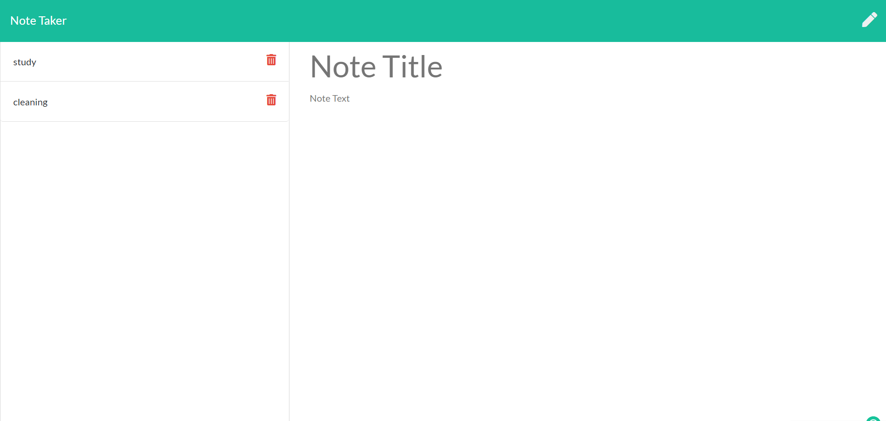

# Note Taker


## Description


Walkthrough video: 

These is a note taker application that can be used to write, save, and delete notes. This application will use an express backend and save and retrieve note data from a JSON file.

## User Story

```
AS A small business owner
I WANT to be able to write save and delete notes
SO THAT I can organize my thoughts and keep track of tasks I need to complete
```


## Table of contents

* [Description](#Description)
* [Installation](#Installation)
* [Usage](#Usage)
* [License](#License)
* [Contributing](#Contributing)
* [Screenshot](#Screenshot)
* [Walk-through](#walk-through)
* [Questions](#Questions)

## Installation
The app is already deplyed on Heroku but to run the codes form the repo on your local machine run : 
```npm install express```
 ```npm install inquirer```
 ```npm install axios```
 ```npm install uuid```

## Usage

When click on get started button on the home page. Click on Note Title to type the title you would like to give to your note. Then clicK on note text to type your note and save it by clicking on the save icon.
From the left side , then you can see your see your saved notes easily and your can grap and edit it as well, and if you dont like it you can permanently delete it.

 

## Licence
This app is under the MIT License.
` Copyright <2021> <Senait T Gerezgiher>

Permission is hereby granted, free of charge, to any person obtaining a copy of this software and associated documentation files (the "Software"), to deal in the Software without restriction, including without limitation the rights to use, copy, modify, merge, publish, distribute, sublicense, and/or sell copies of the Software, and to permit persons to whom the Software is furnished to do so, subject to the following conditions:

The above copyright notice and this permission notice shall be included in all copies or substantial portions of the Software.

THE SOFTWARE IS PROVIDED "AS IS", WITHOUT WARRANTY OF ANY KIND, EXPRESS OR IMPLIED, INCLUDING BUT NOT LIMITED TO THE WARRANTIES OF MERCHANTABILITY, FITNESS FOR A PARTICULAR PURPOSE AND NONINFRINGEMENT. IN NO EVENT SHALL THE AUTHORS OR COPYRIGHT HOLDERS BE LIABLE FOR ANY CLAIM, DAMAGES OR OTHER LIABILITY, WHETHER IN AN ACTION OF CONTRACT, TORT OR OTHERWISE, ARISING FROM, OUT OF OR IN CONNECTION WITH THE SOFTWARE OR THE USE OR OTHER DEALINGS IN THE SOFTWARE.

End license text. `

## Contributing
Feel free to contact me for any suggestion.

## Screenshot


## Walk-through


## Questions
Contact me: senutekie77@gmail.com


